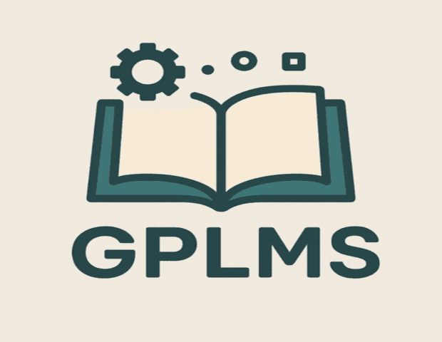

# GPLMS

A GENERAL PURPOSE LIBRARY MANAGEMENT SYSTEM

Made with ❤ by students & the community for the open source community

### We used these Languages

| HTML | CSS | JS | PHP | MYSQL |
|-|-|-|-|-|
|  |  |  |  |  |

 

### We also used these trusted technologies 

 | | | |
|-|-|-|
  |  |  |

  

### Key Features

| Feature                                | Description                                       |
|----------------------------------------|---------------------------------------------------|
|  **Comprehensive Material Cataloging** | Easily organize and manage a wide variety of materials. |
|  **User Management**                  | Includes role-based access for different user types. |
|  **Author & Publisher Management**    | Maintain detailed records of authors and publishers. |
|  **Customizable System Configuration**| Tailor the system to your specific requirements.  |
|  **Detailed Activity Auditing**       | Track and monitor all user actions in the system. |
|  **Role-Based Access Control**        | Ensure secure access based on user roles.         |

 

### Getting Started

| Step       | Action                                                                                      |
|------------|---------------------------------------------------------------------------------------------|
| 1️⃣ Download | Download the latest release from [GitHub Releases](https://github.com/PanagiotisKotsorgios/gplms/releases/latest) |
| 2️⃣ Install  | Install on any PHP/MySQL environment (tested on Apache & phpMyAdmin)                        |
| 3️⃣ Configure| Configure your library settings matching your needs                                                        |
| 4️⃣ Start    | Start managing your library resources!                                                    |

 

### Xaamp Instructions 

`Quick Test Setup`

| Step | Action |
|------|--------|
| 1. **Requirements** | Download and install [XAMPP](https://www.apachefriends.org/) on your system. |
| 2. **Setup** | Copy the `src` folder of the project into XAMPP's `htdocs` directory. |
| 3. **Database** | Import the `importer.sql` file located in the `database` folder into phpMyAdmin. |
| 4. **Access the Application** | Open your browser and navigate to `http://localhost/src`. You're ready to go! |
| 5. **Login** | Use the default credentials below to log in:   **Username:** `admin`   **Password:** `12345` |

### 🚩Notes:
 
 Make sure your `XAMPP server` is running `before` accessing the application.
 For additional `configuration` or `troubleshooting`, refer to the project documentation.

 

---

 

### Project History

This project began as a school project at **[<a href = "https://www.saekmesol.gr/">SAEK MESOLOGHIOY</a>]**, developed by a 2  Software Engineering students team during their final six months of study. 
The initial goal was to create a user-friendly, Agile & Efficient Library Management System. 

<a href = "https://www.saekmesol.gr/">The place it all started</a>

   

`This project was initially created by:`

| Name                                          | Role            | GitHub Profile                          |
|-----------------------------------------------|-----------------|---------------------------------------|
| [Kotsorgios Panagiotis](https://github.com/PanagiotisKotsorgios)   | Initial Creator |  https://github.com/PanagiotisKotsorgios |
| [Markantonatos Fotis](https://github.com/Whatever1977) | Initial Creator | https://github.com/Whatever1977 |

  

### Contribute

We are committed to improving this project and welcome contributions from the community.  

| Action                 | Description                                                      |
|------------------------|------------------------------------------------------------------|
| **Open Issues**        | Report bugs or suggest new features by [opening an issue](https://github.com/PanagiotisKotsorgios/gplms/issues). |
| **Submit Pull Requests** | Contribute directly by adding new features or fixing existing ones. |

Your feedback and support are invaluable in helping us grow this project.

Let’s make it better together!❤😁

